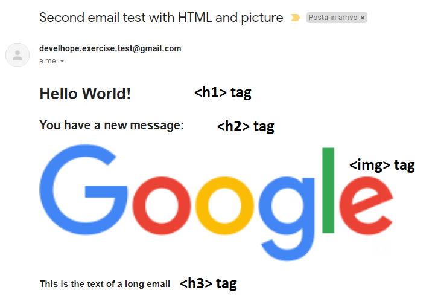

# Esercizio - Spring Boot - Email 2
* replicare la stessa struttura progettuale dell'esercizio `Spring Boot - Email 1`
* invece di inviare un'e-mail di base, invia un'e-mail con un messaggio HTML:
  * usa `MimeMessage` e i tag HTML `<h1>`, `<h2>`, `` e `<h3>`
  * inserisci un'immagine dal web che ti piace
  * all'interno del tag `<h3>`, scrivi il `testo` proveniente dalla richiesta `GET`
* l'output è qualcosa di simile al seguente:

* testare l'endpoint con `Postman`:
  * invia email ad un utente presente nella lista (tu!)
  * prova ad inviare email ad un utente che non è presente nella lista
  * prova a inviare e-mail con un payload errato

# Exercise - Spring Boot - Email 2
* replicate the same project structure of the exercise `Spring Boot - Email 1`
* instead of sending a basic email, send an email with an HTML message:
  * use `MimeMessage` and the HTML tags `<h1>`, `<h2>`, `` and `<h3>`
  * insert an image from the web you like
  * inside the `<h3>` tag, write the `text` coming from the `GET` request
* the output is something similar to the following one:

* test the endpoint with `Postman`:
  * send email to a user that is present in the list (you!)
  * try to send email to a user that is not present in the list
  * try to send email with a wrong payload
* **note for reviewers**: view `Email2.postman_collection.json` in the root folder for all the `Postman` calls
